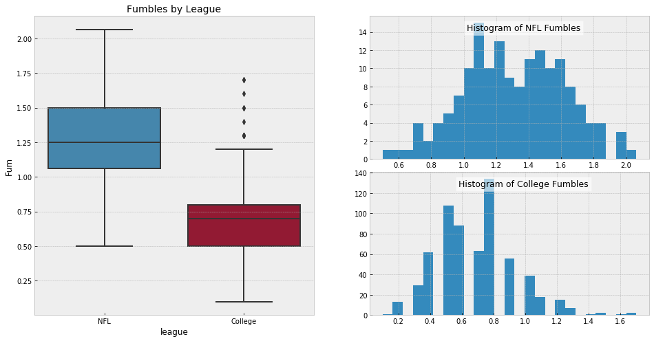

# College Football Team Recommender

## Problem Statement

American Football is a very popular sport in the United States. Two of the biggest leagues that host the sport are the NFL, The National Football League, which is the professional organization that contain 32 teams across the USA, and NCAA College Football, which is the ameatur version of the NFL teams where over 100 Colleges and Universities have a team of student athelethes to compete in the sport. 

These two leagues have similar and contrasting reasons that makes the sport so amazing and competitive. Spectators are generally fans of one and not the other for varying reasons. I would like to make an attempt at bridging that gap. I plan to create a recommender system that recommends a comparative team to the average NFL fan based off of their favorite NFL team and favorite style of play (offense, defense, passing, etc.)

## Organization - How to use this Repo

In order to follow along properly with this repo, I suggest that you read each notebook in the following order:

* 1a_NFL Data Collection
* 1b_College Data Collection
* 2_Data Handling & EDA
* 3_Modeling Notebook
* 4_Recommender Notebook

## Executative Summary

My goal I would like to achieve in creating this recommender is to provide teams that have similar production and style of play as their NFL counterparts. If a particular NFL team was a top all around team in terms of offensive and defensive performance, I want my recommender to return similar college teams with this same performance. This will be a challenge, because though NFL and College are playing the same game with very similar rules, they have different levels of production as far as statistical peformance. This is attributed to several factors that we will not dive into thouroughly, but I will try to account for these differences. The most obvious factor, though, is the NFL has more athletic talent so it changes how the game is played compared to college.

### Data Collection

The data I collected was scraped from the website sportsreference.com. This site is comprised of several sites that provides statistics for MANY sports. Their aim is to provide the most complete and accessible statistics that can be found anywhere.

This site works perfectly for me because it has all of the major stats for both college and NFL football dating back to the start of each of those leagues.

I collected offensive and defensive stats for college football dating back to 1985 and those same stats for the NFL dating back to 1970.  

### Exploratory Data Analysis

I am comparing two different leagues so their statisical peformance varies, on average. Since I am comparing these two, it is important to understand how and what categories differ. To tuly understand the distributions, I created a function that prints out 2 comparative box plots and 2 histograms of each statisical category of choice (a column in my DataFrame) between the NFL and college leagues.

The top findings from these distributions were: 
* Overall the spread of each statistic are generally wider for college than NFL, this make sense as there is only 32 NFL teams represented per year against over 100 college teams represented per year. This will naturally have more variation in their results.
* The average of most of the statistics are typically close between both leagues, with the exception of stats in the rushing category, offensive fumbles, & point totals.

As seen in the image of above, there is a large descrepancy between the number of the rushing attempts that the NFL takes per game compared to the number of attempts that the college league takes. Because of the large difference in this category the other rushing categories follows this same trend.
* NFL has a mean of 26 rushing attempts.
* College has a mean of 39 rushing attempts.

* NFL has a mean of 1.27 fumbles
* College has a mean of 0.68 fumbles

This is an interesting find seeing that the NFL runs the ball less so you would assume that they have less opportunites to fumble, in addition to it being more teams in College translating to more teams having more opportunites for fumbles.

* NFL has a mean of 35 pass attempts a game.
* College has a mean of 31 pass attempts a game

As far as passing attempts the mean of both league are closer together with the NFL attempting 4 more passes on average than college football. College football though have a wider spread with some teams attempting up to 60 passes a game, where as in the NFL the most attempts a game is 43.

### Results

* created a recommender system that compares a single NFL team to the rest of the college football teams.
* it is capable of comparing teams based off of specific statistical categories. Examples include:
    * Overall performance - includes all major categories
    * Offense - includes all categories related to offense (rushing, passing, touchdowns, etc.)
    * Defense - includes all categories related to defense (opponents rushing, passing, touchdowns, etc.)
    * Any other categories down to the specifics of only passing, only rushing.

I developed a web application that takes the foundations of my recommender system and inner function and translates this to the user. It takes 3 input from the user: NFL team of interest, season the team played in, and favorite style of play. After taking these 3 arguments, the user is provided with an instant recommended college team and the specific year of that team. 

## Next Steps

I am very pleased at the results of my college recommender system. I though do believe that it can be greatly improved upon in several ways: 
* I can add more features outside of statistics, like team success, star power, game attendence and ticket sales, etc. I can find more unique statistics to include as features that accurately depicts and compares a team statistical performance each year.
* I compared teams across 5 years (2014-2018), I can extend the range of teams to older periods, while making sure the change in team's performance is accounted for as the style of play changes over the decades.
* create recommenders that solely compare all NFL teams in history to one another and the same for college football. I already have the data readily available so this would be a instant modification to look into.

In addition to the recommender improvements, there are also some improvements that can be made to the application side. Including college team specific content to the user is a great start. When I recommend a team I can provide links to videos, games & events, links to team pages, and also more statistics to chew on. 
Mostly I would like to be able to provide information on what makes these teams similar and why my recommender thought so. Potentially doing some unsupervised learning can be a great tool to help with this. 
